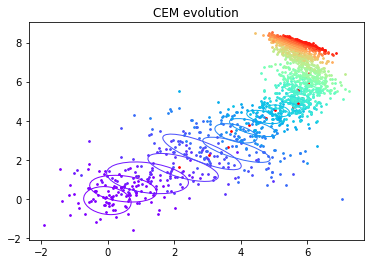
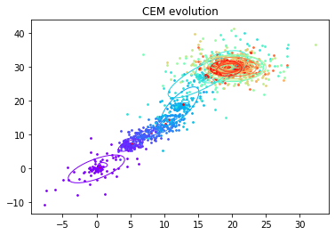

# Improved Cross Entropy Method

This project has for objective to implement a variant of the Cross Entropy Method (CEM) and to compare its performance to the original method on a set of classical benchmarks reinforcement learning.

The cross-entropy method is a Monte Carlo method for optimization. It is applicable to both combinatorial and continuous problems, with either a static or noisy objective. It allows to find a vector
parameters that optimize a cost function.

In the left figure, there is the usual cross-entropy method, the color evolves from indigo to red as the cost improves, the ellipses represents the succesive covariances matrices.

In the right figure, we can observe that, if we take the inverse of the covariance matrice, the main axis of the ellipses is aligned with the progression of the
population. We can see that the optimum is reached faster than the usual cross-entropy method. 

So, we can hypothesise that the use the inverse of the covariance matrice is greater.

The purpose of this project is to determine if its true.

## Quick Start

* Clone BBRL repository : https://github.com/osigaud/bbrl
* Clone Gym repository : https://github.com/osigaud/bbrl_gym
* Clone BBRL_examples : https://github.com/osigaud/bbrl_examples

Then, in those repositories : 
* `pip install -e .`

## Contributors

This project is supervised by [@osigaud](https://github.com/osigaud) and developed by [@AnyesTAFOUGHALT](https://github.com/AnyesTAFOUGHALT), [@Soonies](https://github.com/Soonies) and [@srsrb](https://github.com/srsrb).