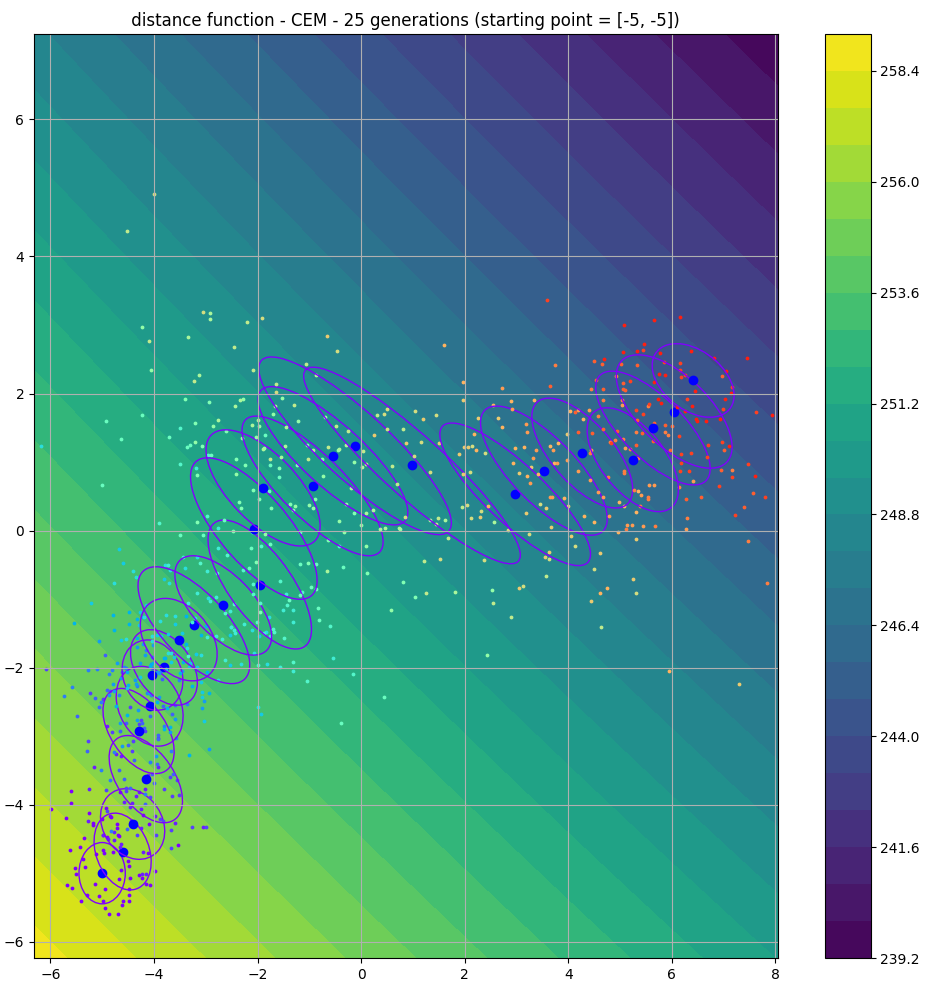
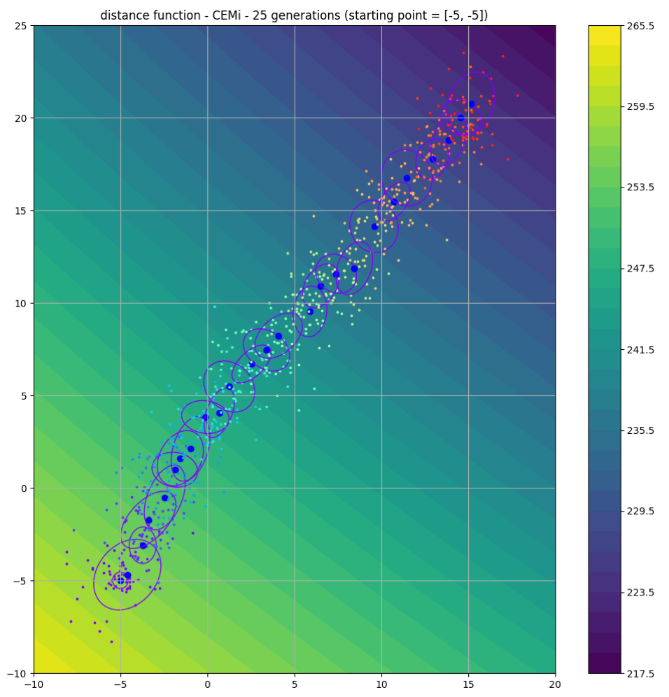

# Improved Cross Entropy Method

This project aims at implementing a variant of the Cross Entropy Method (CEM) and comparing its performance relative to the original, based on a set of classical benchmarks for reinforcement learning.

The cross-entropy method is a Monte Carlo method for optimization. It is applicable to both combinatorial and continuous problems, with either a static or noisy objective. It allows to find a vector of parameters that optimizes a cost function.

The left figure is a run of the usual cross-entropy method, that optimizes a cost function incrementally for a fixed size population. The ellipses represents the succesive covariances matrices of each generation.

In the right figure, we use the inverse of the covariance matrix instead. Our first observation is that the main axis of the ellipses are aligned with the progression of the population, and that the optimum is reached way faster than the usual cross-entropy method. 

Thus our hypothesis on a potential systematic improvement of the C.E.M. with the use  of the inverse of the covariance matrix.

The purpose of this project is to determine the realm within which the latter holds. 

## Quick Start

* Clone BBRL repository : https://github.com/osigaud/bbrl
* Clone Gym repository : https://github.com/osigaud/bbrl_gym
* Clone BBRL_examples : https://github.com/osigaud/bbrl_examples

Then, in those repositories : 
* `pip install -e .`

## Contributors

This project is supervised by [@osigaud](https://github.com/osigaud) and developed by [@AnyesTAFOUGHALT](https://github.com/AnyesTAFOUGHALT), [@Soonies](https://github.com/Soonies) and [@srsrb](https://github.com/srsrb).
